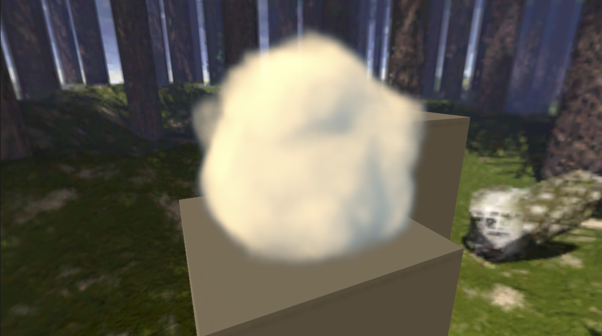

# Unity Volumetric Renderer
**Work in progress!**

___
###TODO:
- [ ] Fix ray transformation.
- [ ] Add lower resolution buffer for ray marching
- [ ] Fix volumes intersection
- [ ] Fix depth intersection
- [ ] Optimization & Refactoring
- [ ] UPM package
---
ref.: [Creating a Volumetric Ray Marcher](https://shaderbits.com/blog/creating-volumetric-ray-marcher) by ShaderBits